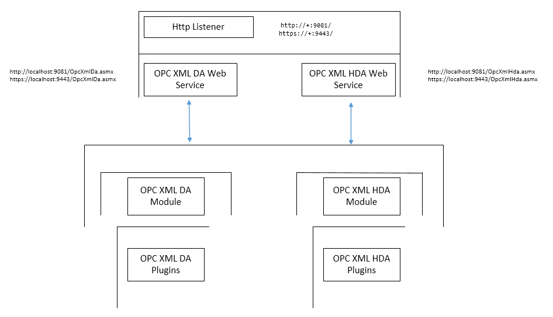

# History

**OLE for Process Control** (**OPC**), which stands for Object Linking and
Embedding (**OLE**) for Process Control, is the original name for
a standards specification developed in 1996 by an industrial
automation industry task force. The standard specifies the communication
of real-time plant data between control devices from different manufacturers.

As of November 2011, the [OPC Foundation](http://en.wikipedia.org/wiki/OPC_Foundation) has officially renamed
the acronym to mean "**Open Platform Communications**" although they also use
the tagline "**Open Productivity & Connectivity**" on their
website.[[1]](http://en.wikipedia.org/wiki/OLE_for_Process_Control#cite_note-1) The
change in name reflects the applications of **OPC** technology for applications
in Process Control, discrete manufacturing, building automation, and many
others. **OPC** has also grown beyond its original **OLE** (Object Linking and
Embedding) implementation to include other data transportation technologies
including [XML](http://en.wikipedia.org/wiki/XML), Microsoft's [.NET Framework](http://en.wikipedia.org/wiki/.NET_Framework), 
and even the **OPC Foundation's** binary-encoded **TCP** format.

The **OPC Foundation** has defined interfaces to Data Access Servers, Event
Servers, Batch Servers, and History Data Access Servers. These servers have
information that is valuable to the enterprise, and is currently being provided
to enterprise applications via **OLE/COM** based interfaces.

**XML**, the eXtensible Markup Language, and **XML**-based schema languages
provide another means to describe and exchange structured information between
collaborating applications. **XML** is a technology that is more readily
available across a wide range of platforms. **OPC XML DA (Data Access)**  
is the **OPC Foundation's** adoption of the **XML** set of
technologies to facilitate the exchange of plant data across the internet, and
upwards into the enterprise domain.

# Overview

**
Fig. 1
**

**Fig. 1** Illustrates a simple diagram of the **Smart OPC XML Server**. 
At the front stands a **HTTP** listener who is responsible to accept client **XML SOAP** 
requests and transfer them to the **OPC XML DA** and **OPC XML HDA** Web services. 
Both **Web** services are respectively connected to the **OPC XML DA** and **OPC XML HDA** modules. 
Below the **OPC XML DA** and **OPC XML HDA** modules are situated loaded plugins for each one of them.

The **HTTP** listener supports both **HTTP** and **HTTPS** schemes. For
**HTTPS** scheme you must provide a server certificate. Also **HTTP** listener
supports different authentication schemes like **Digest**, **Negotiate**,
**NTLM**, **Integrated Windows Authentication**, **Basic** and **Anonymous**.
**HTTP** listener can check client certificate thumbprint for authorization.
User identity from **HTTP** listener is transferred to the **ASP .NET** runtime
where the authorization is made.
