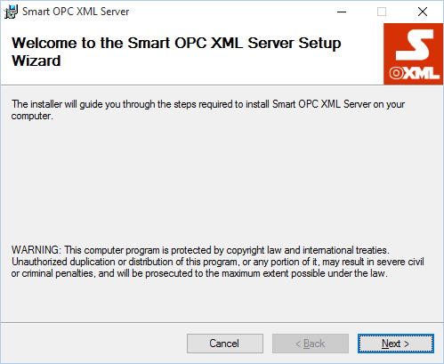
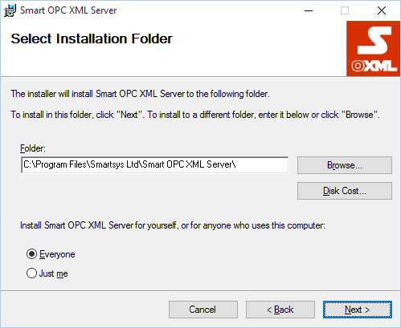
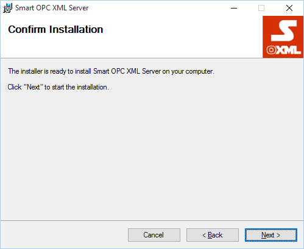
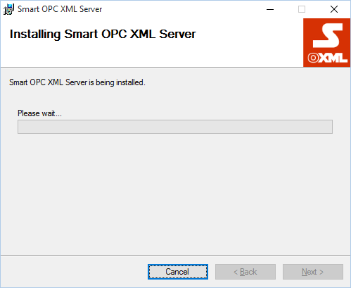
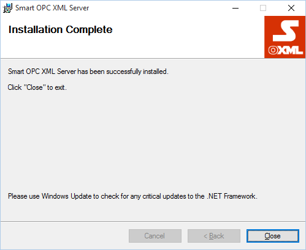

# Prerequisites

- Operating system **Windows 7** / **Windows 2008 Server** or newer;

- **.Net Framework 4.5.1** - You can download and install it from [here](http://www.microsoft.com/en-us/download/details.aspx?id=40779)
 or use the web installer from [here](http://www.microsoft.com/en-us/download/details.aspx?id=40773);

- Some of the plugins (e.g. **Smart.OpcXml.Plugins.OpcDa** and **Smart.OpcXml.Hda.Plugins.OpcHda**) 
require **OPC Core Components Redistributable (x64) 105.1** or **OPC Core Components Redistributable (x86) 105.1** 
depending on what platform you use. You can find it [here](https://opcfoundation.org/developer-tools/developer-kits-classic/core-components/) 
(must be a Member, needs only registration). You may not install **OPC Core Components Redistributable**, 
but you have manually to register the components, how to do that we will explain later;

-   **Smart OPC XML Server Setup** package **x86** or **x64** release;

-   If **ASP. NET** libraries are not installed, you must create the following folders, if don't exist:
    "**C:\Windows\Microsoft.NET\Framework64\v4.0.30319\Temporary ASP.NET Files**" and
    "**C:\Windows\Microsoft.NET\Framework\v4.0.30319\Temporary ASP.NET Files**";

# Running Setup
        
Run the **Smart OPC XML Server** setup package e.g. **Smart OPC XMLServer Setup x64 1_0_xxx_xxx.msi**.



**<center>Fig. 2</center>**

You will see the dialog as shown above. Press the "**Next**" button.



**<center>Fig. 3</center>**

Press the "**Next**" button.



**<center>Fig. 4</center>**

Press the "**Next**" button.



**<center>Fig. 5</center>**

Wait until installation completes.



**<center>Fig. 6</center>**

When installation is completed you will see the dialog as shown above.
Press "**Close**" button. The program is installed in 
**"%SystemDrive%:\Program Files\Smartsys Ltd\Smart OPC XML Server**".

If **ASP .NET** libraries are not installed, open the **Web.config**
file in the root service installation folder (e.g. "**C:\ProgramFiles\Smartsys Ltd\Smart OPC XML Server\Web.config"**). 
Locate the following:

```xml
<assemblyBinding xmlns="urn:schemas-microsoft-com:asm.v1">
    <probing privatePath="Lib"/>
</assemblyBinding>
```

and change the **privatePath="Lib"** to **privatePath="Lib;Bin"** 

```xml
<assemblyBinding xmlns="urn:schemas-microsoft-com:asm.v1">
    <probing privatePath="Lib;Bin"/>
</assemblyBinding>
```

Thus required libraries will be found when starting up.
You must restart the **Smart OPC XML Service**, changes to take effect.

## OPC Core Components Registration

You can omit this step if you plan or already have installed **OPC Core
Components Redistributable** from the **OPC Foundation** or you don't
plan to use **Smart OPC XML Server's** wrapper plugins for connecting to
classic **OPC DA** or **HDA DCOM** servers.

**Smart OPC XML Server** comes with pre-compiled **OPC Core Components**
situdated in "**&lt;InstallDir&gt;\Lib\x86**" for **x86** platform and
"**&lt;InstallDir&gt;\Lib\x64**" for **x64** plarform. You must start the
command prompt as administrator with elevated priviledges and navigate
to the folder for the platform you use and run the "**dllregister.cmd**"
command file to register the components or "**dllunregister.cmd**" to
unregister them.

*__`Remark:`__
If you move the "**&lt;InstallDir&gt;**" somewhere else you must run registration command file again.*