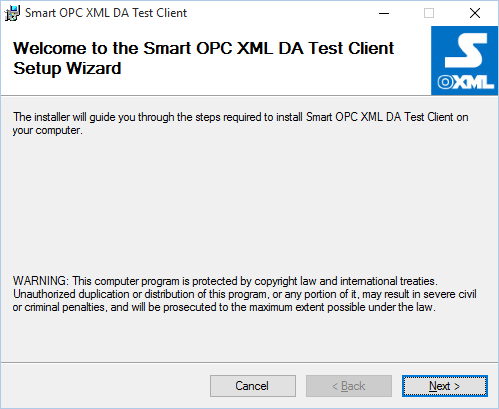
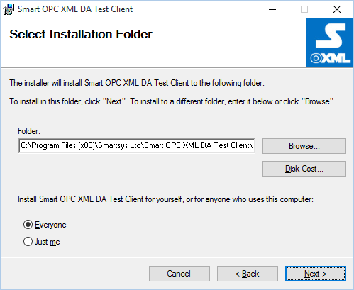
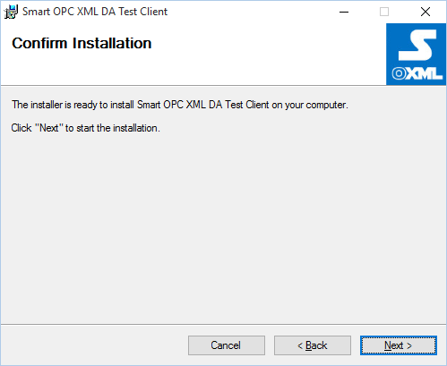
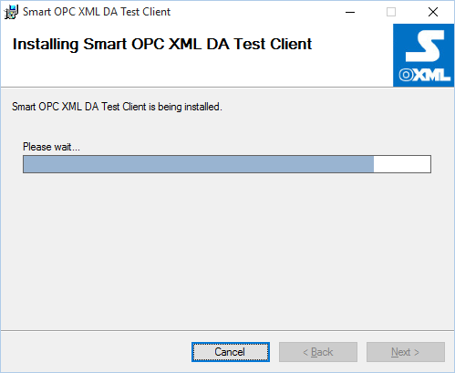
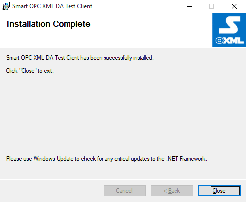
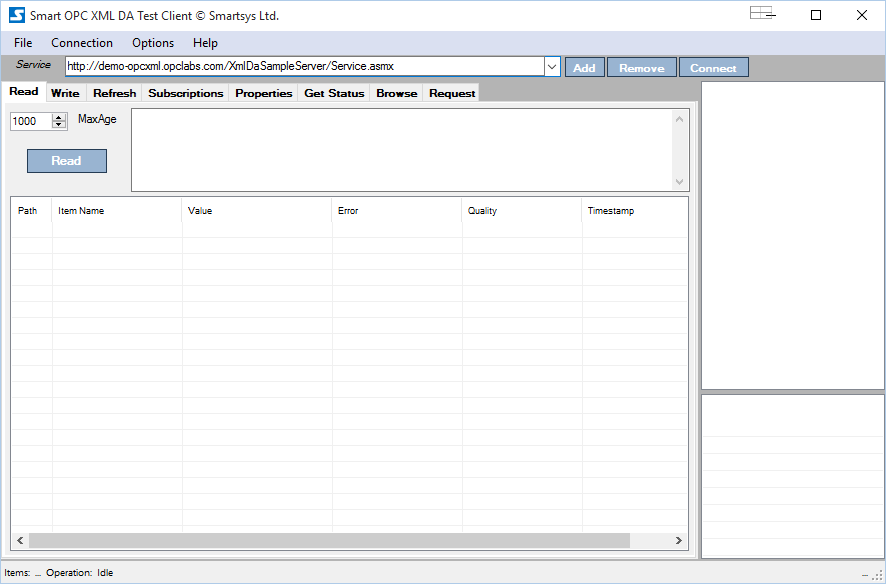
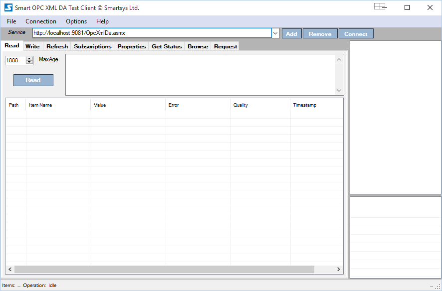
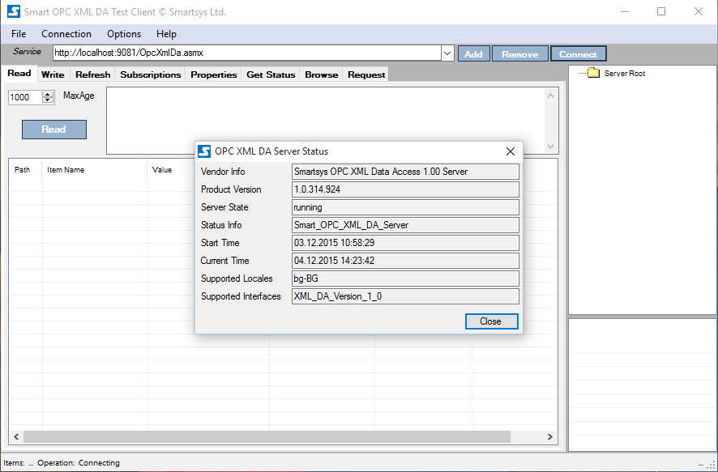

## Prerequisites

- Operating system **Windows 7** / **Windows 2008 Server** or newer;

- **.Net Framework 4.5.1** - You can download and install it from [here](http://www.microsoft.com/en-us/download/details.aspx?id=40779) or use the web installer from [here](http://www.microsoft.com/en-us/download/details.aspx?id=40773);

- **Smart OPC XML DA Test Client** setup package.

## Running Setup

Run the **Smart OPC XML DA Test Client** setup package e.g. **Smart OPC XML DA Test Client Setup x86 1\_0\_282\_821.msi**.

You will see the dialog as shown above. Press the "**Next**" button.

Press the "**Next**" button.

Press the "**Next**" button.

Wait until installation completes.

When installation is completed you will see the dialog as shown above.
Press "**Close**" button. The program is installed in **"%SystemDrive%:\\Program Files (x86)\\Smartsys Ltd\\** **Smart OPC XML DA Test Client**". Also from the programs menu locate the **Smart OPC XML DA Test Client** shortcut and start it.

You shoul see a dialog like shown below.

To connect to a locally installed **Smart OPC XML Server**. Press add button and in **Service** link type <http://localhost:9081/OpcXmlDa.asmx>.

Press the **Connect** button. If everything is OK, then you should see the server status dialog as shown below.

