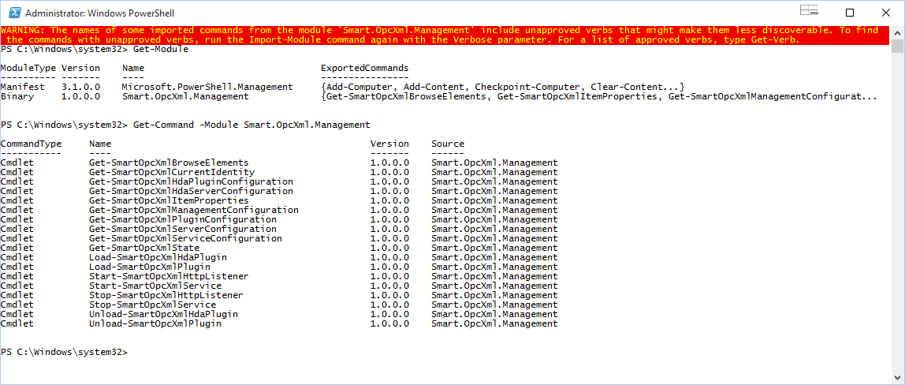
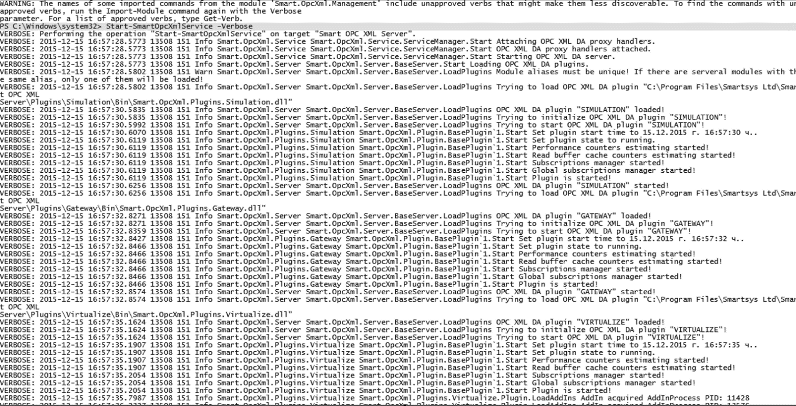
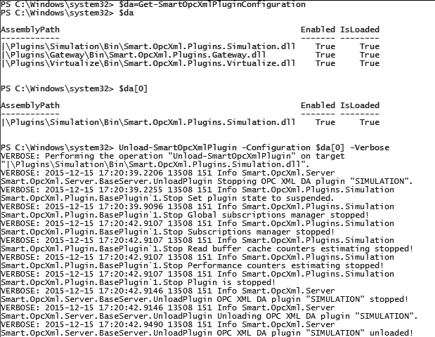
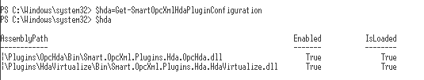
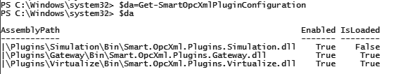

**Smart OPC XML Server** comes with **Smart.OpcXml.Management**
**PowerShell** module located in
**&lt;InstallDir&gt;\\Lib\\Smart.OpcXml.Management.dll**. This module has
configuration file located in
**&lt;InstallDir&gt;\\Lib\\Config\\Smart.OpcXml.Management.Configuration.xml**.

__Example:__

```xml
<?xml version="1.0"?>
<ManagementConfiguration xmlns:xsi="http://www.w3.org/2001/XMLSchema-instance" 
xmlns:xsd="http://www.w3.org/2001/XMLSchema">
  <Port>65255</Port>
  <PermissionRole>Administrators</PermissionRole>
</ManagementConfiguration >
```

The **Smart.OpcXml.Management** module connects to the **Smart OPC XML
Server** on specified management port by "**Port**" attribute.
"**PermissionRole**" attribute defines which role is granted to access
the **Smart OPC XML Server** via **PowerShell** management module. By
default **Smart OPC XML Server** installation does not put a link to the
**PowerShell** with loaded **Smart.OpcXml.Management** module, so it
must be done manually.

__Example:__

```cmd
%SystemRoot%\system32\WindowsPowerShell\v1.0\powershell.exe
-noexit -command import-module 'C:\\Program Files\\Smartsys Ltd\\Smart
OPC XML Server\\Lib\\Smart.OpcXml.Management.dll'
```

**PowerShell** must be run in elevated mode as **Administrator**.  
With **PowerShell** command `Get-Command -Module Smart.OpcXml.Management`
you can obtain list of available commands (**Cmdlets**).




You can use `Get-Help <CmdLet>` to see the command help or
`Get-Help <CmdLet> -Full` to see entire available help for the
command.

By default command result log is not dumped to the **PowerShell**
console. To enable that you must open the
**&lt;InstallDir&gt;\\NLog.config** file. See the target with name
"**Smart.OpcXml.Management.PowerShellNotifier**":

```xml
<target name="Smart.OpcXml.Management.PowerShellNotifier" 
xsi:type="SharedMessage" minLevel ="Info"
      layout="${longdate} ${processid} ${threadid} ${level} ${logger} ${callsite} ${message} ${exception:format=ToString} ${event-context:item=ADEHStackTrace}" />
```

You can change that name to be short like "**PowerShell**" for example.

```xml
<target name="PowerShell" xsi:type="SharedMessage" minLevel ="Info"
      layout="${longdate} ${processid} ${threadid} ${level} ${logger} ${callsite} ${message} ${exception:format=ToString} ${event-context:item=ADEHStackTrace}" />
```

Now in the rules append with "," in the **writeTo** attribute by adding
**PowerShell** target. Avoid adding it to loggers with names
"**Smart.OpcXml.Plugins.OpcDa.AddIn.\***" and
"**Smart.OpcXml.Plugins.Hda.OpcHda.AddIn.\***".

__Example:__

```xml
<rules>
    <logger name="Smart.OpcXml.Service" minlevel="Info" writeTo="Smart.OpcXml.Service,Console,PowerShell" />
    <logger name="Smart.OpcXml.Http" minlevel="Info" writeTo="Smart.OpcXml.Http,Console,PowerShell" />

    <logger name="Smart.OpcXml.Server" minlevel="Info" writeTo="Smart.OpcXml.Server,Console,PowerShell" />
    <logger name="Smart.OpcXml.Plugins.OpcDa" minlevel="Info" writeTo="Smart.OpcXml.Plugins.OpcDa,Console,PowerShell" />
    <logger name="Smart.OpcXml.Plugins.OpcDa.AddIn.*" minlevel="Info" writeTo="Smart.OpcXml.Plugins.OpcDa.AddIn" />
    <logger name="Smart.OpcXml.Plugins.Virtualize" minlevel="Info" writeTo="Smart.OpcXml.Plugins.Virtualize,Console,PowerShell" />
    <logger name="Smart.OpcXml.Plugins.Gateway" minlevel="Info" writeTo="Smart.OpcXml.Plugins.Gateway,Console,PowerShell" />
    <logger name="Smart.OpcXml.Plugins.Gateway.*" minlevel="Info" writeTo="Smart.OpcXml.Plugins.Gateway,Console,PowerShell" />
    <logger name="Smart.OpcXml.Plugins.Simulation" minlevel="Info" writeTo="Smart.OpcXml.Plugins.Simulation,Console,PowerShell" />
    <logger name="Smart.OpcXml.Plugins.Wmi" minlevel="Info" writeTo="Smart.OpcXml.Plugins.Wmi,Console,PowerShell" />
    <logger name="Smart.OpcXml.Plugins.Wmi.*" minlevel="Info" writeTo="Smart.OpcXml.Plugins.Wmi,Console,PowerShell" />

    <logger name="Smart.OpcXml.Hda.HdaServer" minlevel="Info" writeTo="Smart.OpcXml.Hda.HdaServer,Console,PowerShell" />
    <logger name="Smart.OpcXml.Plugins.Hda.OpcHda" minlevel="Info" writeTo="Smart.OpcXml.Plugins.Hda.OpcHda,Console,PowerShell" />
    <logger name="Smart.OpcXml.Plugins.Hda.OpcHda.AddIn.*" minlevel="Info" writeTo="Smart.OpcXml.Plugins.Hda.OpcHda.AddIn" />
    <logger name="Smart.OpcXml.Plugins.Hda.HdaVirtualize" minlevel="Info" writeTo="Smart.OpcXml.Plugins.Hda.HdaVirtualize,Console,PowerShell" />
    <logger name="Smart.OpcXml.Plugins.Hda.HdaGateway" minlevel="Info" writeTo="Smart.OpcXml.Plugins.Hda.HdaGateway,Console,PowerShell" />
    <logger name="Smart.OpcXml.Plugins.Hda.HdaGateway.*" minlevel="Info" writeTo="Smart.OpcXml.Plugins.Hda.HdaGateway,Console,PowerShell" />
  </rules>
```

To take into account made changes the **Smart OPC XML Server** must be
restarted. Now if you type a cmdlet with a "**Verbose**" option, the log
will be outputted to the **PowerShell** console.

__Example:__



When using load or unload plugin commands there is an argument named
"**Configuration**" which is required and is of type
"**PluginConfiguration**". To obtain plugin configuration in array use
the commands `Get-SmartOpcXmlPluginConfiguration`" and
`Get-SmartOpcXmlHdaPluginConfiguration` respectively for **DA** and
for **HDA** plugins.

__Example:__



Here is short description of available cmdlets:

## Get-SmartOpcXmlBrowseElements

*Returns array of browse elements of type **BrowseElement** (see **OPC** **XML** specification).*

__Example:__

```cmd
PS C:\Windows\system32> Get-SmartOpcXmlBrowseElements

Properties  :
Name        : SYSTEM
ItemPath    :
ItemName    : SYSTEM
IsItem      : False
HasChildren : True

Properties  :
Name        : VIRTUALIZE
ItemPath    :
ItemName    : VIRTUALIZE
IsItem      : False
HasChildren : True

Properties  :
Name        : GATEWAY
ItemPath    :
ItemName    : GATEWAY
IsItem      : False
HasChildren : True

PS C:\Windows\system32> Get-SmartOpcXmlBrowseElements -ItemName VIRTUALIZE

Properties  :
Name        : SYSTEM
ItemPath    :
ItemName    : VIRTUALIZE.SYSTEM
IsItem      : False
HasChildren : True

Properties  :
Name        : Virtual
ItemPath    :
ItemName    : VIRTUALIZE.Virtual
IsItem      : False
HasChildren : True
```    

## Get-SmartOpcXmlCurrentIdentity

*Returns current user which runs the command.*

__Example:__

```cmd    
    PS C:\Windows\system32> Get-SmartOpcXmlCurrentIdentity

    PC\User
```    

## Get-SmartOpcXmlHdaPluginConfiguration

*Returns **OPC XML HDA** plugins configuration in array of type "**PluginConfiguration**".*

__Example:__



You can use `$hda[n]` to get the **n**-th element of the array.
Array index is zero based.

## Get-SmartOpcXmlPluginConfiguration

*Returns **OPC XML DA** plugins configuration in array of type "**PluginConfiguration**".*

__Example:__



You can use `$da[n]` to get the **n**-th element of the array.
Array index is zero based.

## Get-SmartOpcXmlHdaServerConfiguration

*Returns **OPC XML HDA Server** part configuration in **XML** format.*

__Example:__

```cmd
PS C:\Windows\system32> Get-SmartOpcXmlHdaServerConfiguration

<?xml version="1.0" encoding="utf-16"?>
<BaseHdaServerConfiguration xmlns:xsd="http://www.w3.org/2001/XMLSchema" xmlns:xsi="http://www.w3.org/2001/XMLSchema-instance">
  <LoggerName>Smart.OpcXml.Hda.HdaServer</LoggerName>
  <MaxItemsPerHdaReadAtTime>0</MaxItemsPerHdaReadAtTime>
  <MaxItemsPerHdaReadProcessed>0</MaxItemsPerHdaReadProcessed>
  <MaxItemsPerHdaReadRaw>0</MaxItemsPerHdaReadRaw>
  …
  <SupportHdaBrowse>true</SupportHdaBrowse>
  <DebugTraceFirstChanceExceptions>false</DebugTraceFirstChanceExceptions>
  <DebugTraceUnhandledExceptions>false</DebugTraceUnhandledExceptions>
</BaseHdaServerConfiguration>
```

## Get-SmartOpcXmlServerConfiguration

*Returns **OPC XML DA Server** part configuration in **XML** format.*

__Example:__

```cmd
PS C:\Windows\system32> Get-SmartOpcXmlServerConfiguration

<?xml version="1.0" encoding="utf-16"?>
<BaseServerConfiguration xmlns:xsd="http://www.w3.org/2001/XMLSchema" xmlns:xsi="http://www.w3.org/2001/XMLSchema-instance">
  <SupportBrowse>true</SupportBrowse>
  <SupportGetProperties>true</SupportGetProperties>
  <SupportRead>true</SupportRead>
  <SupportWrite>true</SupportWrite>
  <SupportSubscribe>true</SupportSubscribe>
  …
  <DebugTraceFirstChanceExceptions>false</DebugTraceFirstChanceExceptions>
  <DebugTraceUnhandledExceptions>false</DebugTraceUnhandledExceptions>
  <Plugin AssemblyPath="|\Plugins\Simulation\Bin\Smart.OpcXml.Plugins.Simulation.dll" Enabled="true" />
  <Plugin AssemblyPath="|\Plugins\Gateway\Bin\Smart.OpcXml.Plugins.Gateway.dll" Enabled="true" />
  <Plugin AssemblyPath="|\Plugins\Virtualize\Bin\Smart.OpcXml.Plugins.Virtualize.dll" Enabled="true" />
</BaseServerConfiguration>
```    

## Get-SmartOpcXmlServiceConfiguration

*Returns **Smart OPC XML Service** configuration in **XML** format.*

__Example:__

```cmd
PS C:\Windows\system32> Get-SmartOpcXmlServiceConfiguration

<?xml version="1.0" encoding="utf-16"?>
<Configuration xmlns:xsd="http://www.w3.org/2001/XMLSchema" xmlns:xsi="http://www.w3.org/2001/XMLSchema-instance">
  <RemotingServiceName>Smart_OpcXml_BaseServerProxy</RemotingServiceName>
  <RemotingServicePort>35101</RemotingServicePort>
  <RemotingChannelType>Tcp</RemotingChannelType>
  <HdaRemotingServiceName>Smart_OpcXml_BaseHdaServerProxy</HdaRemotingServiceName>
  <HdaRemotingServicePort>35102</HdaRemotingServicePort>
  <HdaRemotingChannelType>Tcp</HdaRemotingChannelType>
  <EnableRemoting>false</EnableRemoting>
  <HttpListenerPrefixes>
    <string>http://+:9081/</string>
  </HttpListenerPrefixes>
  <HttpListenerThreads>16</HttpListenerThreads>
  <HttpListenerAuthenticationScheme>Anonymous</HttpListenerAuthenticationScheme>
  <ClientCertificateHashes />
  <ValidateClientCertificates>false</ValidateClientCertificates>
  <HttpCompressionModuleEnableCompression>true</HttpCompressionModuleEnableCompression>
  <UseChunkedTransfer>true</UseChunkedTransfer>
  <HttpRequestQueueLength>1</HttpRequestQueueLength>
  <DebugTraceFirstChanceExceptions>false</DebugTraceFirstChanceExceptions>
  <DebugTraceUnhandledExceptions>false</DebugTraceUnhandledExceptions>
  <HttpServerDebugTraceFirstChanceExceptions>false</HttpServerDebugTraceFirstChanceExceptions>
  <HttpServerDebugTraceUnhandledExceptions>false</HttpServerDebugTraceUnhandledExceptions>
</Configuration>
```    

## Get-SmartOpcXmlManagementConfiguration 

*Returns **ManagementConfiguration** of the **Smart OPC XML Server** management service (local port and required permission role of to user to use it).*

__Example:__

```cmd
PS C:\Windows\system32> Get-SmartOpcXmlManagementConfiguration

Port PermissionRole
---- --------------
65255 Administrators
```

## Get-SmartOpcXmlStaste

*Returns **Smart OPC XML Server** state. Possible server states are: Starting, Started, Stopping, Stopped.*

__Example:__

```cmd
PS C:\Windows\system32> Get-SmartOpcXmlState
Started
```

## Get-SmartOpcXmlItemProperties

*Returns item properties of a specified element either by **ItemPath** and **ItemName** or **Element** parameter.*

__Example:__

```cmd
PS C:\Windows\system32> Get-SmartOpcXmlItemProperties -ItemName SIMULATION.Random.Int

Value       : -1741497407
Name        : http://opcfoundation.org/webservices/XMLDA/1.0/:value
Description : Item Value
ItemPath    :
ItemName    :
ResultID    :

Value       : 1000
Name        : http://opcfoundation.org/webservices/XMLDA/1.0/:scanRate
Description : Server Scan Rate
ItemPath    :
ItemName    :
ResultID    :
…
```

__Example:__

```cmd
PS C:\Windows\system32> $elements=Get-SmartOpcXmlBrowseElements -ItemName SIMULATION.Random
PS C:\Windows\system32> Get-SmartOpcXmlItemProperties $elements[0]

Value       : -806949978
Name        : http://opcfoundation.org/webservices/XMLDA/1.0/:value
Description : Item Value
ItemPath    :
ItemName    :
ResultID    :

Value       : 1000
Name        : http://opcfoundation.org/webservices/XMLDA/1.0/:scanRate
Description : Server Scan Rate
ItemPath    :
ItemName    :
ResultID    :
…
```

## Stop-SmartOpcXmlHttpListener

*Stops the **HTTP** listener of **Smart OPC XML Server**. By stopping the **HTTP** listener, the clients will not be able to connect the **SOAP** web service of the server.*

__Example:__

```cmd
PS C:\Windows\system32> Stop-SmartOpcXmlHttpListener -Verbose
VERBOSE: Performing the operation "Stop-SmartOpcXmlHttpListener" on target "Smart OPC XML
Server http listner".
VERBOSE: 2015-12-15 18:34:40.1437 3912 46 Info Smart.OpcXml.Http
Smart.OpcXml.Http.HttpServer.Stop Stopping HTTP server!
VERBOSE: 2015-12-15 18:34:40.1437 3912 46 Info Smart.OpcXml.Http
Smart.OpcXml.Http.HttpServer.Stop Signalling stop event!
VERBOSE: 2015-12-15 18:34:40.1437 3912 46 Info Smart.OpcXml.Http
Smart.OpcXml.Http.HttpServer.Stop Waiting requests handler thread #0 to complete!
VERBOSE: 2015-12-15 18:34:40.1593 3912 46 Info Smart.OpcXml.Http
…
VERBOSE: 2015-12-15 18:34:40.1593 3912 46 Info Smart.OpcXml.Http
Smart.OpcXml.Http.HttpServer.Stop Waiting requests handler thread #15 to complete!
VERBOSE: 2015-12-15 18:34:40.1759 3912 46 Info Smart.OpcXml.Http
Smart.OpcXml.Http.HttpServer.Stop Stopping HTTP listener!
VERBOSE: 2015-12-15 18:34:40.1759 3912 46 Info Smart.OpcXml.Http
Smart.OpcXml.Http.HttpServer.Stop HTTP server is stopped!
VERBOSE: 2015-12-15 18:34:40.1789 3912 46 Info Smart.OpcXml.Service
Smart.OpcXml.Service.ServiceManager.StopHttpListener HTTP listener stopped!
```

## Start-SmartOpcXmlHttpListener

*Start the **HTTP** listener of **Smart OPC XML Server**. By starting the **HTTP** listener, the clients will be able to connect the **SOAP** web service of the server.*

__Example:__

```cmd
PS C:\Windows\system32> Start-SmartOpcXmlHttpListener -Verbose

VERBOSE: Performing the operation "Start-SmartOpcXmlHttpListener" on target "Smart OPC XML
 Server http listner".
VERBOSE: 2015-12-15 18:35:43.8770 3912 57 Info Smart.OpcXml.Http
Smart.OpcXml.Http.HttpServer.Start Starting HTTP server!
VERBOSE: 2015-12-15 18:35:43.8785 3912 57 Info Smart.OpcXml.Http
Smart.OpcXml.Http.HttpServer.Start Starting HTTP listener!
VERBOSE: 2015-12-15 18:35:43.8785 3912 57 Info Smart.OpcXml.Http
Smart.OpcXml.Http.HttpServer.Start Starting requests handler thread #0!
VERBOSE: 2015-12-15 18:35:43.8785 3912 57 Info Smart.OpcXml.Http
…
Smart.OpcXml.Http.HttpServer.Start Starting requests handler thread #15!
VERBOSE: 2015-12-15 18:35:43.9095 3912 57 Info Smart.OpcXml.Http
Smart.OpcXml.Http.HttpServer.Start HTTP server is started!
VERBOSE: 2015-12-15 18:35:43.9196 3912 57 Info Smart.OpcXml.Service
Smart.OpcXml.Service.ServiceManager.StartHttpListener HTTP listener started!
```

## Stop-SmartOpcXmlService

*Stops the entire **Smart OPC XML Server**, stops the **HTTP** listener, stops and unloads **DA** and **HDA** plugins, but the application remains loaded in memory.*

__Example:__

```cmd
PS C:\Windows\system32>Stop-SmartOpcXmlService –Verbose

VERBOSE: Performing the operation "Stop-SmartOpcXmlService" on target "Smart OPC XML
Server".
VERBOSE: 2015-12-15 18:42:14.2282 3912 164 Info Smart.OpcXml.Service
Smart.OpcXml.Service.ServiceManager.Stop Stopping HTTP listener.
VERBOSE: 2015-12-15 18:42:14.2302 3912 164 Info Smart.OpcXml.Http
Smart.OpcXml.Http.HttpServer.Stop Stopping HTTP server!
VERBOSE: 2015-12-15 18:42:14.2302 3912 164 Info Smart.OpcXml.Http
Smart.OpcXml.Http.HttpServer.Stop Signalling stop event!
VERBOSE: 2015-12-15 18:42:14.2302 3912 164 Info Smart.OpcXml.Http
Smart.OpcXml.Http.HttpServer.Stop Waiting requests handler thread #0 to complete!
VERBOSE: 2015-12-15 18:42:14.2302 3912 164 Info Smart.OpcXml.Http
…
stopped!
VERBOSE: 2015-12-15 18:42:34.7284 3912 164 Info Smart.OpcXml.Hda.HdaServer
Smart.OpcXml.Hda.HdaServer.BaseHdaServer.Stop Unloading OPC XML HDA plugins.
VERBOSE: 2015-12-15 18:42:34.7284 3912 164 Info Smart.OpcXml.Hda.HdaServer
Smart.OpcXml.Hda.HdaServer.BaseHdaServer.Stop OPC XML HDA server is stopped!
VERBOSE: 2015-12-15 18:42:34.7382 3912 164 Info Smart.OpcXml.Service
Smart.OpcXml.Service.ServiceManager.Stop OPC XML HDA server stopped.
VERBOSE: Service stopped!
```

## Start-SmartOpcXmlService

Starts the entire **Smart OPC XML Server**.

__Example:__

```cmd
PS C:\Windows\system32>Start-SmartOpcXmlService –Verbose
VERBOSE: Performing the operation "Start-SmartOpcXmlService" on target "Smart OPC XML
Server".
VERBOSE: 2015-12-15 18:43:47.3255 3912 57 Info Smart.OpcXml.Service
Smart.OpcXml.Service.ServiceManager.Start Attaching OPC XML DA proxy handlers.
VERBOSE: 2015-12-15 18:43:47.3255 3912 57 Info Smart.OpcXml.Service
Smart.OpcXml.Service.ServiceManager.Start OPC XML DA proxy handlers attached.
VERBOSE: 2015-12-15 18:43:47.3255 3912 57 Info Smart.OpcXml.Service
…
VERBOSE: 2015-12-15 18:43:57.1122 3912 57 Info Smart.OpcXml.Http
Smart.OpcXml.Http.HttpServer.Start HTTP server is started!
VERBOSE: 2015-12-15 18:43:57.1249 3912 57 Info Smart.OpcXml.Service
Smart.OpcXml.Service.ServiceManager.Start HTTP listener started.
VERBOSE: Service started!
```
 
## Unload-SmartOpcXmlHdaPlugin

*Stops and unloads **OPC XML HDA** plugin.*

__Example:__


```cmd
PS C:\Windows\system32>Unload-SmartOpcXmlHdaPlugin –Configuration $hda[0] –Verbose
```

## Load-SmartOpcXmlHdaPlugin

*Loads and starts **OPC XML HDA** plugin.*

__Example:__


```cmd
PS C:\Windows\system32>Unload-SmartOpcXmlHdaPlugin –Configuration $da[0] –Verbose
```

## Unload-SmartOpcXmlPlugin 

*Stops and unloads **OPC XML DA** plugin.*

__Example:__


```cmd
PS C:\Windows\system32>Unload-SmartOpcXmlHdaPlugin –Configuration $da[0] –Verbose
```

## Load-SmartOpcXmlPlugin

*Loads and starts **OPC XML DA** plugin.*

__Example:__


```cmd
PS C:\Windows\system32>Load-SmartOpcXmlPlugin –Configuration $da[0] –Verbose
```