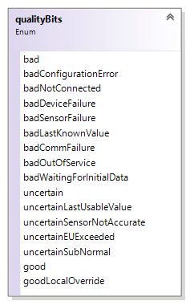

# Overview


## GetStatus

```csharp
ReplyBase GetStatus(string LocaleID, 
                    string ClientRequestHandle,
                    out ServerStatus Status)
```


## Read

```csharp
ReplyBase Read(RequestOptions Options, 
               ReadRequestItemList ItemList, 
               out ReplyItemList RItemList, 
               out OPCError[] Errors)
```




## Write
```csharp
ReplyBase Write(RequestOptions Options, 
                WriteRequestItemList ItemList, 
                bool ReturnValuesOnReply, 
                out ReplyItemList RItemList, 
                out OPCError[] Errors)
```


## Subscribe

```csharp
ReplyBase Subscribe(RequestOptions Options, 
                    SubscribeRequestItemList ItemList, 
                    bool ReturnValuesOnReply, 
                    int SubscriptionPingRate, 
                    out SubscribeReplyItemList RItemList, 
                    out OPCError[] Errors, 
                    out string ServerSubHandle)
```


## SubscriptionPolledRefresh

```csharp
ReplyBase SubscriptionPolledRefresh(RequestOptions Options, 
                                    string[] ServerSubHandles, 
                                    DateTime HoldTime, 
                                    bool HoldTimeSpecified, 
                                    int WaitTime, 
                                    bool ReturnAllItems, 
                                    out string[] InvalidServerSubHandles, 
                                    out SubscribePolledRefreshReplyItemList[] RItemList, 
                                    out OPCError[] Errors, 
                                    out bool DataBufferOverflow)
```


## SubscriptionCancel

```csharp
void SubscriptionCancel(string ServerSubHandle, 
                        ref string ClientRequestHandle)
```

## Browse

```csharp
ReplyBase Browse(XmlQualifiedName[] PropertyNames, 
                 string LocaleID, 
                 string ClientRequestHandle, 
                 string ItemPath, 
                 string ItemName, 
                 ref string ContinuationPoint, 
                 int MaxElementsReturned, 
                 browseFilter BrowseFilter, 
                 string ElementNameFilter, 
                 string VendorFilter, 
                 bool ReturnAllProperties, 
                 bool ReturnPropertyValues, 
                 bool ReturnErrorText, 
                 out BrowseElement[] Elements, 
                 out OPCError[] Errors, 
                 out bool MoreElements)
```


## GetProperties

```csharp
ReplyBase GetProperties(ItemIdentifier[] ItemIDs, 
                        XmlQualifiedName[] PropertyNames, 
                        string LocaleID, 
                        string ClientRequestHandle, 
                        string ItemPath, 
                        bool eturnAllProperties, 
                        bool ReturnPropertyValues, 
                        bool ReturnErrorText, 
                        out PropertyReplyList[] ropertyLists, 
                        out OPCError[] Errors)
```


