# Overview
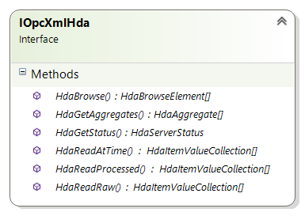

# HdaReadRaw

```csharp
HdaItemValueCollection[] HdaReadRaw(
           HdaTime startTime,
           HdaTime endTime,
           int maxValues,
           bool includeBounds,
           HdaItemIdentifier[] items)
```

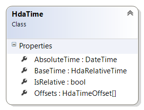
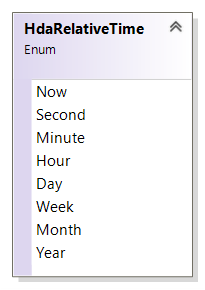
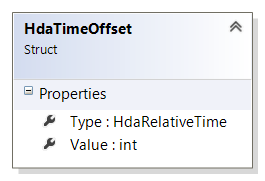
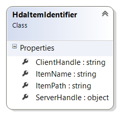
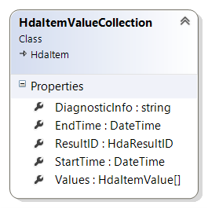
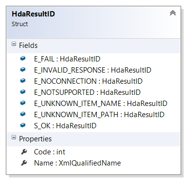
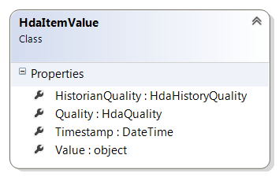
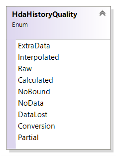
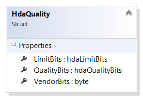
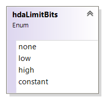
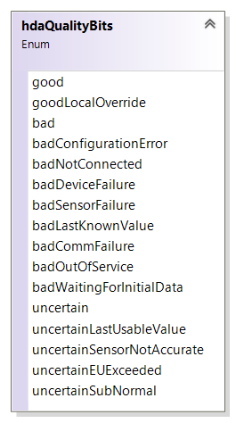

# HdaReadProcessed

```csharp
HdaItemValueCollection[] HdaReadProcessed(HdaTime startTime,
            HdaTime endTime,
            decimal resampleInterval,
            HdaItem[] items)
```

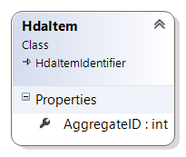

# HdaBrowse

```csharp
HdaBrowseElement[] HdaBrowse(HdaItemIdentifier item)
```

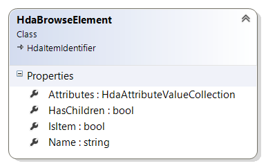
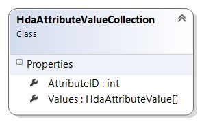
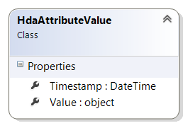

# HdaGetStatus

```csharp
HdaServerStatus HdaGetStatus(HdaItemIdentifier item)
```

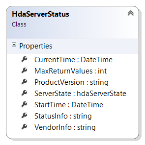
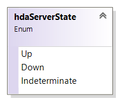

*``Remarks:`` HdaItemIdentifier argument is used to navigate to the OPC HDA
server of which to get the status. If item identifier is null, status of
the plugin will be returned.*

# HdaGetAggregates

```csharp
HdaAggregate[] HdaGetAggregates(HdaItemIdentifier item)
```

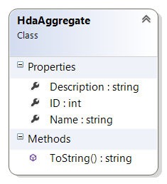
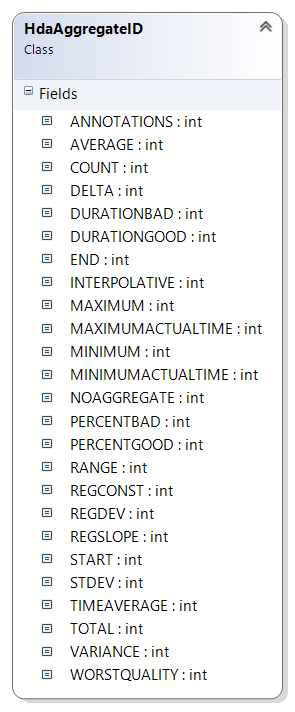

# HdaReadAtTime

```csharp
HdaItemValueCollection[] HdaReadAtTime(DateTime[] timestamps, HdaItemIdentifier[] items)
```

*``Remarks:`` Not supported by all OPC HDA servers.*

```csharp
public class HdaAggregateID {
        public const int NOAGGREGATE = 0;
        public const int INTERPOLATIVE = 1;
        public const int TOTAL = 2;
        public const int AVERAGE = 3;
        public const int TIMEAVERAGE = 4;
        public const int COUNT = 5;
        public const int STDEV = 6;
        public const int MINIMUMACTUALTIME = 7;
        public const int MINIMUM = 8;
        public const int MAXIMUMACTUALTIME = 9;
        public const int MAXIMUM = 10;
        public const int START = 11;
        public const int END = 12;
        public const int DELTA = 13;
        public const int REGSLOPE = 14;
        public const int REGCONST = 15;
        public const int REGDEV = 16;
        public const int VARIANCE = 17;
        public const int RANGE = 18;
        public const int DURATIONGOOD = 19;
        public const int DURATIONBAD = 20;
        public const int PERCENTGOOD = 21;
        public const int PERCENTBAD = 22;
        public const int WORSTQUALITY = 23;
        public const int ANNOTATIONS = 24;
    }
```