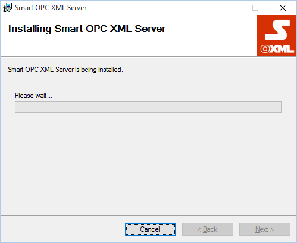

# Инсталиране {: #install}


На фигурата по-горе е показана опростена схема на **Smart OPC XML Server**.
Най-отгоре е показан **HTTP** лисънър, който посреща клиентски **SOAP**
заявки и ги предава на по-долните нива за обработка.
**HTTP** лисънъра поддържа **HTTP** и **HTTPS** схеми. За **HTTPS** е
небходим сертификат и допълнителна настройка. **HTTP** лисънъра поддържа
следните типове автенитикация: **Digest**, **Negotiate**, **NTLM**,
**Integrated Windows Authentication**, **Basic** and **Anonymous**. Той
също може да авторизира отпечатъка на клиентския сертификат.

**Предпоставки**

- Операционна **Windows 7** / **Windows 2008 Server** или по-нова;

- **.Net Framework 4.5.1** - Може да свалите от
[тук](http://www.microsoft.com/en-us/download/details.aspx?id=40779)
или да използвате уеб инсталатор от [тук](http://www.microsoft.com/en-us/download/details.aspx?id=40773);

- Плъгините за връзка с класически **OPC DCOM DA/HDA** изискват **OPC Core Components Redistributable (x64) 105.1** и/или **OPC Core Components Redistributable (x86) 105.1**, в зависимост от платформата която използвате. Може да свалите от тук (изисква регистрация). Може да не инсталирате **OPC Core Components Redistributable**, ако вече са инсталирани от друго приложени, ако не ще трябва ръчно да ги регистрирате, което не е препоръчително;

- **Smart OPC XML Server Setup** дистрибутив x86 или x64;

- Ако **ASP. NET** библиотеките не са инсталирани, трябва ръчно да
създадете следните директории, ако не съществуват:  
**C:\\Windows\\Microsoft.NET\\Framework64\\v4.0.30319\\Temporary
ASP.NET Files**  
**C:\\Windows\\Microsoft.NET\\Framework\\v4.0.30319\\Temporary
ASP.NET Files**

**Стартиране на инсталация**

Стартирайте **Smart OPC XML Server** инсталационнен пакет  
(напр. **Smart OPC XML Server Setup x64 1\_0\_xxx\_xxx.msi)**.


След като видите диалога показан на фигурата по-горе натиснете бутон "**Next**".


Натинсете бутон "**Next**".


Натинсете бутон "**Next**".



Изчакайте инсталацията да завърши.


Когато инсталацията завърши, натиснете бутона "**Close**". Приложението
е инсталирано в  
"**%ProgramFiles%\\Smartsys Ltd\\Smart OPC XML Server**"  
или  
"**%ProgramFiles(x86)%\\Smartsys Ltd\\Smart OPC XML Server**"  
в зависимост от платформата.

Ако **ASP .NET** библиотеките не са инсталирани, отворете **Web.config**  
(**%ProgramFiles%\\Smartsys Ltd\\Smart OPC XML Server\\Web.config**).  
Намерете следното:

```xml
<assemblyBinding xmlns="urn:schemas-microsoft-com:asm.v1">
   <probing privatePath="Lib" />
</assemblyBinding>
```

и променете `privatePath="Lib"` на `privatePath="Lib;Bin"`.

```xml
<assemblyBinding xmlns="urn:schemas-microsoft-com:asm.v1">
   <probing privatePath="Lib;Bin" />
</assemblyBinding>
```

Така необходимите билбиотеки ще бъдат открити при стартиране. Промените ще влязат в сила при следващото стартиране на услугата **Smart OPC XML Service**.

# Конфигуриране {: #configure}

**Структура на директориите**

**&lt;InstallDir&gt;** - Инсталационна директория на приложението.
Тук се намира основният файл, с който се пуска приложението ;

> **Bin** - Специфични за приложението библиотеки;  
> **Config** - Конфигурационни файли;  
> **Lib** - Споделени библиотеки;  
>> **Config** - Конфигурационен файл за менажиране посредством
Power Shell;  

> **Logs** - Лог файлове;  
> **Plugins** - Директория на плъгините;
>> **Gateway** - **OPC XML DA** шлюз;  
>> **HdaGateway** - **OPC XML HDA** шлюз;  
>> **HdaVirtualize** - **OPC XML HDA** виртуални точки;  
>> **OpcDa** - **OPC DA** конектор;  
>> **OpcHda** - **OPC HDA** конектор;  
>> **Simulation** - **OPC XML DA** симулация;  
>> **Virtualize** - **OPC XML DA** виртуални точки;  
>> **Wmi** - **WMI** конектор;

Обикновено всеки плъгин се състои от 3 под-директории:

**Bin** - Библиотеки на плъгина;  
**Config** - Конфигурационни файлове;  
**Logs** - Лог файли;

**HTTP лисънър**

Конфигурацията на **HTTP** лисънъра се намира в  
„**&lt;InstallDir&gt;\\Config\\Smart.OpcXml.Service.Configuration.xml**".

**Префикси**

Префиксите описват на кои **IP** адреси **(**интерфейси**)** и портове
лисънъра ще чака клиентски заявки. Примера по-долу показва конфигурация
на лисънър, който обслужва заявки получени на порт 9081 (**HTTP**) от
всички възможни интерфейси:

__Пример:__

```xml
<HttpListenerPrefixes>
    <string>http://+:9081/</string>
</HttpListenerPrefixes>
```

**URI** префиска се състои от схема (**http** или **https**), хост,
опционален порт, и опционална пътека. Например
"**http://www.contoso.com:8080/customerData/**". Префиксите трябва да
завършват с обратна наклонена черта "**/**".

Когато порта е посочен а хост елемента е "**\***", означава че се
приемат всички заявки получени на посоченият порт, които нямат друго
съвпадение по префикс и не са обработени от някой друг лисънър.
Например, за да прихванем всички заявки по HTTP на порт 8080, които не
са прихванати от някой друг лисънър, префикса трябва да бъде
"**http://\*:8080/**". Ако искаме **HTTP** лисънъра да приема всички
заявки, заменяме хост елемента с "**+**", "**http://+:8080**".
"**\***" и "**+**" могат да участват в префикси, които съдържат
пътища.

По подразбуиране сървъра приема **HTTP** заявки на порт **9081**  
(<http://localhost:9081/OpcXmlDa.asmx>, <http://localhost:9081/OpcXmlHda.asmx>).

# Регистриране на OPC Core Components {: #register-opc-core-components}

Може да пропуснете тази стъпка ако вече са инсталирани или не смятате да
се свързвате с класически **OPC COM DA/HDA**.

**Smart OPC XML Server** идва с пре-компилирани **OPC Core Components**
намиращи се в 
"**%ProgramFiles%\\Smartsys Ltd\\Smart OPC XML Server\\Lib\\x86**"  
и  
"**%ProgramFiles%\\Smartsys Ltd\\Smart OPC XML Server\\Lib\\x64**".  
В зависимост от платформата стартирайте като
администратор **dllregister.cmd** за да регистрирате или
**dllunregister.cmd** за да премахнете регистрацията на компонентите.

*``Внимание:`` Не се препоръчва ръчно регистриране, вместо това
използвайте дистрибуциите на **OPC Foundation**.*

# Конфигуриране OPC XML DA модул {: #configure-opc-xml-da-module}

**Smart OPC XML Server** се състои от 2 основни модула - **Smart OPC XML Data Access** 
и **Smart OPC XML Historical Data Access**. Тези 2 модула
зареждат различни плъгини. Конфигурациите на модулите, кои плъгини да
зареждат се намират в директория **\<InstallDir\>\\Config**.

Конфигурацията на **Smart OPC XML DA** модула се намира в  
**&lt;InstallDir&gt;\\Config\\Smart.OpcXml.Server.Configuration.xml** файл.
За да се разреши/забрани зареждането на даден плъгин, трябва да се укаже
в конфигурационият файл.

__Пример:__

```xml
<Plugin AssemblyPath="|\Plugins\Simulation\Bin\Smart.OpcXml.Plugins.Simulation.dll" Enabled="false" />
<Plugin AssemblyPath="|\Plugins\Gateway\Bin\Smart.OpcXml.Plugins.Gateway.dll" Enabled="false" />
<Plugin AssemblyPath="|\Plugins\OpcDa\Bin\Smart.OpcXml.Plugins.OpcDa.dll" Enabled="true" />
<Plugin AssemblyPath="|\Plugins\Wmi\Bin\Smart.OpcXml.Plugins.Wmi.dll" Enabled="false" />
<Plugin AssemblyPath="|\Plugins\Virtualize\Bin\Smart.OpcXml.Plugins.Virtualize.dll" Enabled="false" />
```

Добре е плъгините, които не се използват да са спрени. На примера
по-горе са спрени всички плъгини с изключение на
**Smart.OpcXml.Plugins.OpcDa**. За да конфигурира даден плъгин да се
зареди, трябва да се създаде **Plugin** секция, в която в
**AssemblyPath** да се опише пътя до библиотеката на плъгина, и да се
настрои параметъра **Enabled**="**true**". Символа "**\|**" в началото
означава, че пътя е относителен спрямо инсталационната директория на
приложението ("**&lt;InstallDir&gt;**"). Ако пропуснете символа "**\|**" ще
трябва да опишете абсолютният път до плъгина.

По подразбиране следните плъгини се зареждат: **Simulation**, **Gateway** 
и **Virtualize**.