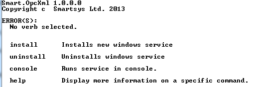
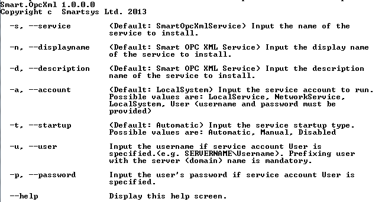
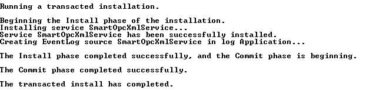
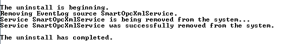
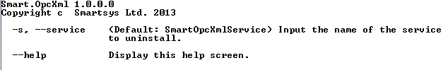

Installation package automatically registers/deregisters **Smart OPC XML
Server** as **Windows** service respectively on intall and uninstall, so
you can omit this point.

Open command windows into the installation folder of **Smart OPC XML
Server** and type the following command:

`Smart.OpcXml.Service.exe` and press **Enter**. You should see the
following:



The **Smart.OpcXml.Service.exe** is the main binary of the **Smart OPC
XML Server**. There are several commands shown:

* **install** - this command installs **Smart OPC XML Server** as 
**Windows Service**;

* **uninstall** - this command uninstalls **Smart OPC XML Server Windows
Service**;

* **console** - this command runs **Smart OPC XML Server** like a regular
console program;

* **help** - displays more information on a specific command.

If you type `Smart.OpcXml.Service.exe help install` and press **Enter**, you should
see the following:



You can see detailed help information about options for the install
command. If you do not specify an options, the default values will be
used. For example if you do not specify service startup type, by default
it will be automatic.

For example if you want to install the service, specifying a user
account you can do the following:

```cmd
Smart.OpcXml.Service.exe install -a User -u .\theUser -p thePassword
```

After typing the command above and pressing Enter you
should see this:



Now if you want to start the service, the only thing you need to do is
to type:

```cmd
net start SmartOpcXmlService
```

You should see the following result:


If your service fails to start you should check the server log files for
errors ("**C:\\Program Files\\Smartsys Ltd\\Smart OPC XML
Server\\Logs**") and also should check windows application event logs
for errors, because the fail may happen before intialziation of logging.

*``Remark:`` The user under the service is started must be elevated or to
have access to the server folders to read required files and to write
logs.*

*``Remark:`` Stopping the service takes longer time than starting it. If
you type "**net stop SmartOpcXmlService**" you may receive the
following:*


Usually this is not a problem, stopping really takes a longer time and
if you check from services tab after few minutes you will see that the
service really is stopped.

If you want to uninstall the service, first stop it, after that type the
following in the command window:

```cmd
Smart.OpcXml.Service.exe uninstall
```

You should see the following:



*``Remark:`` By default windows service is named **SmartOpcXmlService**,
but it can be changed with the "**-s**" option of the install command,
which we do not recommend, but if it is done then you must specify the
service which to be uninstalled with the "**-s**" option of the
uninstall command.*



*``Remark:`` Display name of the service, which is shown in the services
tab is different from the name of the service, used for starting and
stopping with the "**net**" command.*